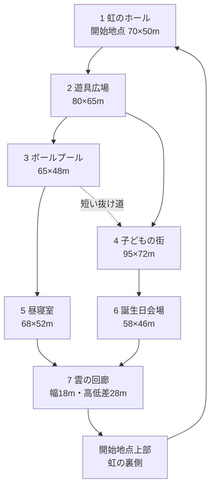

# 第4世界「遊戯室」設計

## 目的

幼児向け屋内遊戯施設を、人がいないまま際限なく増築された空間として構成する。敵、追跡、暗闇、ジャンプスケアは使わない。青空柄の壁、虹、遊具、子ども用の街、昼寝室、誕生日会場を、明るさと縮尺の食い違いでドリームコアとして成立させる。

背景画像は最遠部の窓外だけに限定する。プレイヤーが向かいたくなる虹、遊具、扉、部屋はすべて実体のある3D形状にする。

## マップ上面図

想定範囲は約260m × 210m。中央の遊具広場から二つの環状経路へ分岐し、どちらから進んでも開始地点へ戻れる。完全な迷路にはしない。



概略座標。Yは高さで、表はX/Z平面を示す。

```text
 北 / -Z

 ┌──────────────────────────────────────────────────────────┐
 │  [5 昼寝室]──────[7 雲の回廊・上層]──────[6 誕生日会場] │
 │       │                    ╲                    │         │
 │       │                     ╲                   │         │
 │ [3 ボールプール]──抜け道──[2 遊具広場]────[4 子どもの街]│
 │       ╲                      │                   ╱         │
 │        ╲──────────────[1 虹のホール]──────────╱          │
 │                           開始地点                        │
 └──────────────────────────────────────────────────────────┘

 南 / +Z
```

| 区域 | 中心座標 X/Z | 床高 | 天井高 | 遠くから見える目印 |
|---|---:|---:|---:|---|
| 虹のホール | 0 / 76 | 0m | 22m | 三重に反復する虹 |
| 遊具広場 | 0 / 10 | 0m | 25m | 赤い屋根と滑り台 |
| ボールプール | -82 / -30 | -1m | 18m | 四色のプール縁 |
| 子どもの街 | 88 / -24 | 0m | 16m | 小さな家と信号 |
| 昼寝室 | -94 / -94 | 0m | 28m | 発光するカーテン |
| 誕生日会場 | 88 / -100 | 0m | 14m | 長い机と旗飾り |
| 雲の回廊 | 0 / -112 | 8〜28m | 34m | 雲型の橋と大窓 |
| 虹の裏側 | 0 / 55 | 18m | 24m | ホールを見下ろす縁 |

## 必要な3D素材

### A. 空間を成立させる必須素材

| 素材 | 種類 | 必要数 | 実装 | 状況 |
|---|---|---:|---|---|
| 巨大な虹のアーチ | ランドマーク | 3寸法 | 同一GLBを縮尺変更 | **試作済み** |
| 滑り台付き遊具 | ランドマーク | 2構成 | GLB、曲面は18分割 | **試作済み** |
| ボールプール | ランドマーク | 2寸法 | 縁GLB＋球のインスタンス | **試作済み** |
| 部屋外殻 | 建築 | 7区域 | 壁・柱・天井をモジュール化 | 未制作 |
| 丸い開口部 | 建築 | 大中小3種 | 虹と同じ曲率規則 | 未制作 |
| 小さな扉 | 誘導 | 3種 | 高さ1.2〜1.8m | 未制作 |
| 雲型の高架歩廊 | 上層経路 | 4部品 | 直線・曲線・分岐・踊り場 | 未制作 |
| 大窓 | 遠景枠 | 2種 | ガラスは1枚面、奥に簡略室内 | 未制作 |

### B. 遊具広場

| 素材 | バリエーション | 描画方法 |
|---|---:|---|
| トンネル | 直線、曲線、窓付き | 低分割円筒を結合 |
| 吊り橋 | 1種 | 橋板はインスタンス、網は板テクスチャ |
| 階段 | 幅違い2種 | 形状結合 |
| クッションブロック | 6形状 | インスタンス＋色違い |
| 柵 | 直線、角、端部 | インスタンス |
| 遊具用マット | 円、楕円、不整形 | 地面より2cm上の単一面 |

### C. 子どもの街

| 素材 | バリエーション | 描画方法 |
|---|---:|---|
| 小型住宅 | 4輪郭 | 4〜6材質に結合したGLB |
| 店舗正面 | パン、くつ、郵便 | 看板はアトラス |
| 信号 | 1種 | 同一モデルを再利用 |
| 街灯 | 1種 | インスタンス |
| 横断歩道 | 直線、ずれた線 | デカールではなく薄い面 |
| ベンチ | 2種 | インスタンス |
| 子ども用車両 | 3輪郭 | 動かさない低ポリゴンモデル |

### D. 昼寝室・誕生日会場

| 素材 | バリエーション | 描画方法 |
|---|---:|---|
| 敷布団 | 柄4種 | 形状1種＋アトラス、40枚をインスタンス |
| 枕 | 2形状 | インスタンス |
| カーテン | 開、半開、閉 | 低分割の波形面 |
| 壁時計 | 時刻6種 | 文字盤アトラス |
| 長机 | 長短2種 | GLBまたは単純形状 |
| 子ども椅子 | 4色 | インスタンス |
| 紙皿・紙コップ | 各1種 | 近景分のみ配置 |
| 円錐帽子 | 4色 | インスタンス |
| ケーキ | 1種 | 発見地点用の近景モデル |
| 旗飾り | 柄4種 | 三角形を1バッチ化 |

### E. 反復する小物

- 靴箱
- ロッカー
- ごみ箱
- 給水器
- 壁面クッション
- 非常口扉
- 天井照明
- 換気口
- カメラ
- 館内案内板
- 積み木
- 忘れられた靴
- 転がるボール1個

小物は全区域へ均等に散らさない。区域ごとに2〜3種類へ絞り、生活の痕跡を集中させる。

## 必要なテクスチャ

最大1024px。広い壁や床は反復テクスチャ、小物は1枚のアトラスを共有する。

| テクスチャ | 解像度 | 用途 |
|---|---:|---|
| 青空壁紙 | 1024² | 空色、紙の継ぎ目、退色。雲は別デカール |
| 雲デカールアトラス | 1024² | 12種類の不均一な白い雲 |
| カーペット | 1024² | 毛足を立体化せず、色むらと短繊維を法線で表現 |
| EVAマット | 512² | 継ぎ目、浅い凹凸、擦れ |
| 擦れた樹脂 | 1024² | 赤黄緑青を4区画にしたアトラス |
| 壁・天井パネル | 1024² | 継ぎ目、照明焼け、薄い汚れ |
| 布柄アトラス | 1024² | 布団、枕、カーテン |
| 子どもの街アトラス | 1024² | 店舗、窓、看板、郵便受け |
| 誕生日アトラス | 1024² | 旗、紙皿、帽子、時計文字盤 |
| 窓外の室内 | 1024×512 | 最遠層だけに使う。到達先には使わない |

### 質感のルール

- 虹と遊具は新品の光沢にせず、粗さ0.6〜0.8程度の擦れた樹脂にする。
- カーペットの毛をジオメトリで作らない。
- 雲は同じ絵を規則的に並べず、12種を回転・反転して使う。
- 壁の汚れは下端と角へ寄せ、全面ノイズにしない。
- 文字は固有の詩的名称ではなく、「あそびば」「おひるね」「でぐち」など普通の語だけを使う。

## 発見地点

| # | 地点 | 見る実物 |
|---:|---|---|
| 1 | 大きな虹 | 開始地点の主アーチ |
| 2 | 虹の裏 | 上層から見える未塗装面 |
| 3 | 滑り台の上 | 遊具の最上部 |
| 4 | トンネルの奥 | 壁へ接続された行き止まり |
| 5 | ボールプール中央 | 色の違う球が一つだけある場所 |
| 6 | 小さな商店 | 子どもの街の店内 |
| 7 | 信号のない交差点 | 道路が室内壁へ続く場所 |
| 8 | 最後の布団 | 列の端に一枚だけ離れた布団 |
| 9 | 時計の壁 | 異なる時刻の時計群 |
| 10 | 誕生日席 | 名前のないケーキの正面 |
| 11 | カーテンの裏 | 窓ではなく同じ部屋が見える場所 |
| 12 | 雲の回廊 | 開始地点を上から見下ろす場所 |

## 音素材

- 遠いオルゴール：主旋律を明瞭にしない短いループ
- 空調の低音：全区域共通の基層
- 蛍光灯のハム：虹のホールと昼寝室
- ボールが一個転がる音：ボールプールの偶発音
- 遠い館内放送：意味を判別できない音量
- 布・カーペット上の移動音：床区域用
- 樹脂遊具への軽い接触音：遊具広場用
- 誕生日会場の別室音楽：壁越しに聞こえる帯域へ加工

## 偶発変化に必要な素材差分

- 滑り台：赤／青の材質差分
- 壁の雲：通常／雲が一つ増えた差分
- 誕生日席：椅子の通常位置／机へ寄った位置
- 時計：異なる時刻／すべて同じ時刻
- 遠い扉：閉／少し開く
- ボールプール：表面の球を1個だけ移動

追加モデルは作らず、既存オブジェクトの材質・表示・位置を切り替える。

## 描画予算

| 項目 | スマートフォン目標 | PC目標 |
|---|---:|---:|
| draw calls | 120以下 | 150以下 |
| 表示三角形 | 120,000以下 | 190,000以下 |
| 同時表示区域 | 現在地＋隣接1区域 | 現在地＋隣接2区域 |
| テクスチャ常駐量 | 約18MB以下 | 約32MB以下 |
| 動的ライト | 0 | 0〜1 |

部屋単位で表示を切り替える。開口部から見える隣室は簡略モデルを使用し、全区域を同時描画しない。

## 制作順

1. **形状確認**：虹、滑り台、ボールプール（完了）
2. **表面確認**：青空壁紙、カーペット、樹脂アトラスを試作し、3素材へ適用
3. **空間確認**：虹のホールと遊具広場だけを実寸で組み、移動と画角を確認
4. **経路確認**：ボールプール、子どもの街、上層回廊を灰色モデルで追加
5. **世界完成**：昼寝室、誕生日会場、小物、音、発見、偶発変化を追加
6. **性能調整**：区域表示切替、LOD、材質結合、スマートフォン実測

## 現在の制作物

- `outputs/assets/playroom/playroom-rainbow.glb`
- `outputs/assets/playroom/playroom-slide.glb`
- `outputs/assets/playroom/playroom-ball-pit.glb`
- `source/blender/playroom-assets.blend`
- `source/previews/playroom-assets-preview.png`
- `work/build_playroom_assets.py`
